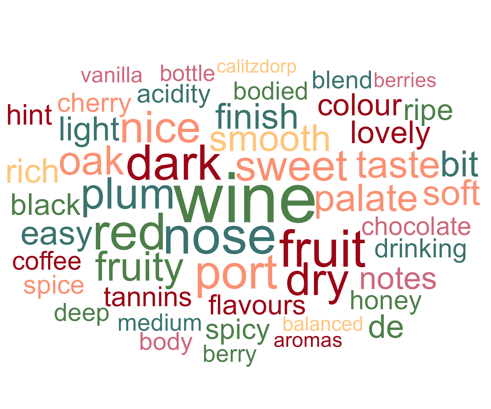
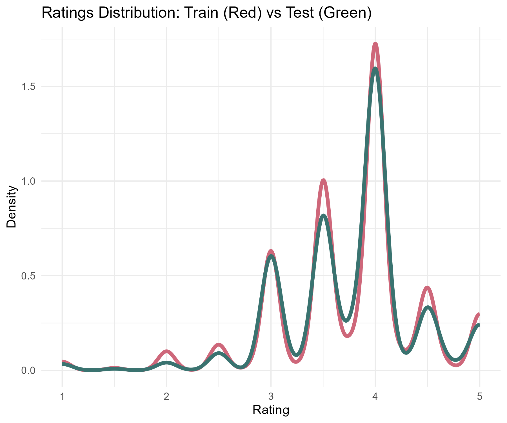
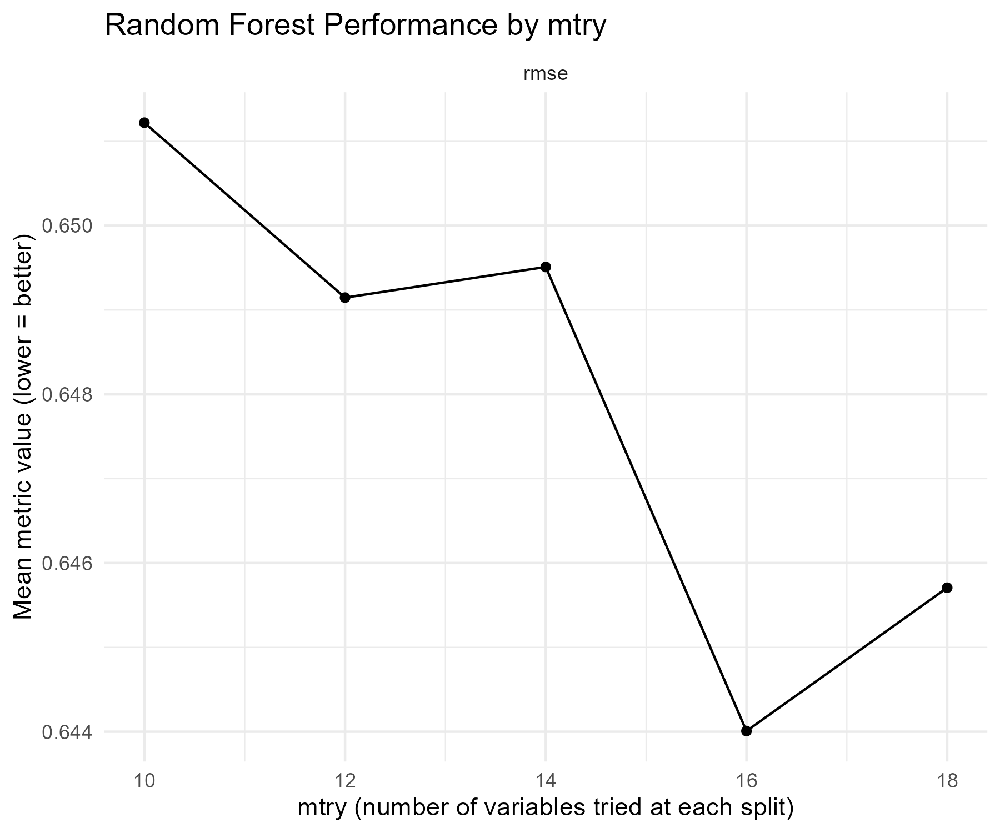
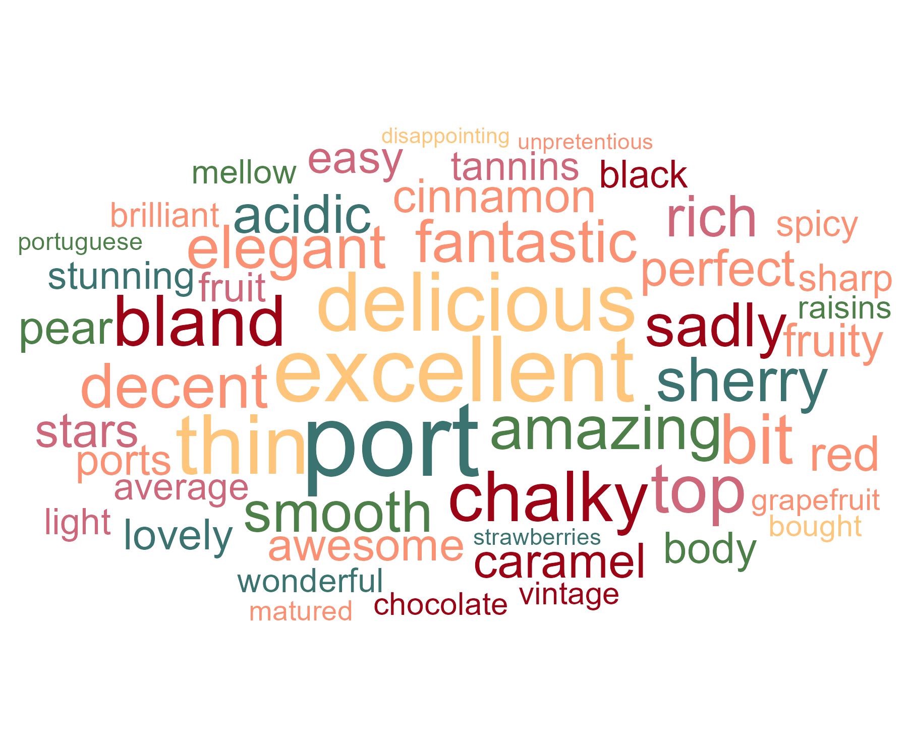

---
# ----- Output format:
title: "Grape minds think alike"
documentclass: "elsarticle"
Thesis_FP: FALSE
output:
  pdf_document:
    keep_tex: TRUE
    template: Tex/TexDefault.txt
    fig_width: 3.5 # Default figure sizes
    fig_height: 3.5

# ----- Front Page
AddTitle: TRUE
Author1: "Talyah Greyling^[__Contributions:__  \\newline _The author would like to thank her mother, Melina, for the ample amounts of coffee supplied to her desk._]" 
Ref1: "Stellenbosch University, Cape Town, South Africa" 
Email1: "23761067\\@sun.ac.za" 
CorrespAuthor_1: TRUE

# ----- Headers and footers:
BottomLFooter: Grape minds think alike                    
TopLHeader: \leftmark 
BottomRFooter: "\\footnotesize Page \\thepage"
addtoprule: TRUE
addfootrule: TRUE 

# ----- Page margins:
margin: 2.3 # Sides
bottom: 2 # Bottom
top: 2.5 # Top
HardSet_layout: TRUE 

# ----- Line numbers:
linenumbers: FALSE

# ----- References:
bibliography: Tex/ref.bib       # References location
csl: Tex/harvard-stellenbosch-university.csl # Referencing format used

# ----- General:
RemovePreprintSubmittedTo: TRUE  
toc: FALSE                      
numbersections: TRUE            # Number sections, figures and tables
fontsize: 11pt                  
linestretch: 1.2                
link-citations: TRUE            # Add dynamic links to papers in reference list

abstract: |
  This paper utilises a Random Forest model as a variable selector and performs a subsequent OLS regression analysis to determine which words (if any) in wine reviews best predict their rating. The author's results are statistically significant at the 0% level and indicate that a correlation does indeed exist between these two metrics such that positive descriptives have a positive effect on ratings and vice versa. The effect of negative descriptives is however found to be of a larger magnitude, thereby portraying loss aversion. 

---

```{r setup, include = FALSE}
knitr::opts_chunk$set(echo = FALSE, 
                      message = FALSE, 
                      warning = FALSE, 
                      fig.width = 6, 
                      fig.height = 5, 
                      fig.align = 'center',
                      fig.pos = 'H')
```

```{r Housekeeping, include = FALSE}

# Load necessary packages:
pacman::p_load(kableExtra,
               knitr, 
               tidyr,
               tidyverse)
               
# Set location: 
loc <- "C:/Users/Talyah Greyling/Documents/1) Meesters/1) Data Science 871/Data_Science_Project_23761067_GitHub/"

```
<!-- # References cheat sheet:  -->
<!-- # save as BibTex -->
<!-- # normal: @fama1997[p. 33] -->
<!-- # in brackets: [@grinold2000] -->
<!-- # join 2: \& -->

<!-- # reference a section: Section \ref{section.name} -->
<!-- # reference a figure: Figures \ref{Figure1} -->

\newpage
```{r vivino logo, out.width = "0.8\\linewidth"}


```

# Introduction 
\label{Intro}

Grape minds think alike... or do they? The objective of this study is to investigate which words (if any) used in wine reviews are associated with higher wine ratings on an online marketplace platform. The data utilised in this study is a sample drawn from Vivino ^[_follow [this link](https://www.vivino.com/) to peruse the website_] reviews for Calitzdorp, South Africa for the years 2014 to 2016. Section \ref{LitRev} contains a review of the existing literature surrounding sentiment and, more specifically, wine descriptives. Thereafter section \ref{Data} explains how the data was cleaned and transformed and embarks on an exploratory description and analysis of the data through histograms and word clouds. In section \ref{StatMod} statistical modelling is employed in a two-step process consisting of a Random Forest variable selection method and an OLS (Ordinary Least Squares) regression to determine which words used in wine reviews are the best predictors of good ratings. Thereafter a conclusion is drawn in section \ref{Concl}. 

\newpage
# Literature review 
\label{LitRev}

## Economic importance
The South African Wine Harvest Report (2023) lists South Africa among the top 10 largest wine producers globally, noting that the country produces approximately 4% of the global wine supply. Additionally, over R55 billion of the country’s GDP can be attributed to the wine industry which employs roughly 269 000 workers [@WoSA2023]. The Economic importance of this research question therefore lies in understanding which key themes, categories or experiences drive good ratings to enable wine producers to use these metrics to improve their product and by extension better the country's GDP and employment (if the boost in ratings and income generated is significant enough). 

## Sentiment analysis 
@AliEtAl2025 describes sentiment analysis as the undertaking of determining the opinions and emotions conveyed via text and other media. This has a multitude of applications in our increasingly technologically driven society in the domains of e-commerce and marketing, social media, politics and health. With the explosion of text based content during the fourth industrial revolution, @DangEtAl2021 explain that a vast amount of opposing representations of anything ranging from facts to opinions can be found online. This gives sentiment analysis an important role to play in deciphering this new technological landscape we find ourselves in. @AlalwanEtAl2018 note that utilising data mining tools and social media analytics have indeed given businesses invaluable insight into the preferences, attitudes and behaviour of their customers. 

However, these online platforms where individuals have the freedom to write whatever and however they deem fit are equally hazardous as they can facilitate the spread of incorrect information. @VosoughiEtAl2018 found incorrect information to actually spread wider and faster on social media than its true counterpart. Nevertheless, these platforms form an integral part of sentiment analysis since they provide an ever changing source of data that is becoming more complex and connected by the day [@DangEtAl2021]. 

Vivino is predominantly an online marketplace, but can also be considered as a social media platform of sorts. The mechanics of the site's interface and features, to a large extent, mirror those of any standard social media platform. Vivino users create a profile with an accompanying profile picture and are able to follow and therefore be followed by other users. Furthermore, users are able to post images alongside their wine reviews, which other users can then like, comment on or share at their own discretion. The reviews shared on Vivino are therefore subject to the same emotional and behavioural biases as social media posts which means that value can be added to understanding the inner workings of this platform's data by applying sentiment analysis techniques. 

## Wine descriptives 
Sentiment analysis has proven to be a useful tool to analyse the wine industry before. Previous accounts include the study done by @BarbieratoEtAl2022, who used reviews on packaged wine tour experiences extracted from TripAdvisor, an online travel review website, to identify the themes present in wine tourism experiences and separate them into positive or negative bins based on their sentiment. They also established the elements defining users' perceptions of quality to understand how wine tourists value the different features of the wine landscape. 

@Bangwayo2025S also drew on data from TripAdvisor to analyse sentiment by focusing on user's online discussions regarding two US wine festivals (yet another element of wine tourism) to identify the usefulness of topics & emotions in guiding the purchasing behaviour of future users. 

Another wine related sentiment study, done by @RuiEtAl2025, aims to bridge the gap in comprehending post-purchase satisfaction within wine e-commerce by analysing consumers' feedback in prominent markets located in the US, UK and China. Using text mining they find differences, by market in consumers' online wine shopping preferences and aversions and provide a guide that producers and platforms alike can utilise to improve their sales and services. 

\newpage
# Exploratory data description & analysis 
\label{Data}

## Data, transformation and cleaning
The original dataset comprises 2298 observations of 107 variables, each encapsulating different aspects and features related to the user, vintage of wine and winery concerned in each review. Table 1 contains the column name as well as a description for each of the variables extracted for use in this analysis.  

\begin{table}[ht]
\centering
\begin{tabular}{|r|l|l|}
\hline
\textbf{} & \textbf{Variable} & \textbf{Description} \\
\hline
1 & id & Identification code of review \\
2 & rating & Rating out of 5 assigned to the wine by the reviewer \\
3 & note & Note written about the wine by the reviewer \\
4 & language & Language of the review \\
\hline
\end{tabular}
\caption{Description of Variables}
\label{tab:variables}
\end{table}

The original dataset was modified slightly by filtering out all reviews posted in languages other than English since using APIs to translate them to English was too costly an endeavor to undertake. 1667 of the original observations remained. 

The reviews were tokenized and 30 800 tokens were recorded where-after I followed the standard pre-processing steps of removing punctuation, numbers, symbols, characters and taking everything to lower case. I also used the default tidyverse stop_words dataset to remove stop words using 3 respective lexicons: snowball (from the tm package), onix (from the ONIX text retrieval system) and smart (from the SMART information retrieval system). After these intermediate steps there were 16 869 tokens remaining. All 'clean' tokes were ultimately used in the Random Forest model to avoid unnecessary sampling bias. 

## Data Exploration
First, I was interested in uncovering the distribution of ratings associated with review tokens. This was done by calculating the average rating associated with each unique token and visualising the frequency observed for each rating through the histogram presented in Figure 1. The high frequency of observations that can be seen at a rating of 3.5 and 4 suggest that there may be certain words driving better ratings. 

```{r fig1, fig.cap = "Histogram of average ratings of review tokens", out.width = "0.8\\linewidth"}


```

To gain a bit of insight into which words these might be I created a popularity index that used the formula stated in equation 3.1 to determine the popularity of each token. 

\begin{equation}
    \text{popularity\_index} = 0.8 \times \text{word\_count} + 0.2 \times \text{ave\_rating}
\end{equation}

The most popular words (i.e. words that get high ratings and are used frequently) in reviews based on my index can be seen in the word cloud depicted in Figure 2. It comes as no surprise that wine is the most 'popular' word in a collection of wine review data. The words to take notice of however are port, dark, nose, sweet and red. It is interesting to note that 4/5 of these most popular words seem best suited to describing red, instead of white wines. 

```{r fig2, fig.cap = "Word cloud of popular words in reviews based on popularity index", out.width = "0.8\\linewidth"}



```

The wide difference in importance of tokens as portrayed by both Figures 1 & 2 were of a large enough extent to merit the statistical modelling in the next section. 

\newpage
# Statistical modelling 
\label{StatMod}
To uncover the underlying relationship between words used in wine reviews and high ratings a two-step statistical modelling process was employed. 

## Step 1: Random Forest 
The first step entailed utilising a Random Forest model as a method to select the 20 review-words (or 'variables') that best predicted a high rating. This model was chosen for its ability to handle complex datasets effectively as well as its scope for completing classification and regression tasks in a manner that is easy to interpret.  

To employ step 1 the tokenized data was first converted into a document term matrix of words each re-linked to their respective ratings. Thereafter I partitioned the dataset into two subsets for training and testing. I decided to adopt the most generally used splitting practice and divide the data by means of a 70/30 split, whereby the 70% of the data is used as the training set and the other 30% of the data is saved for testing. By employing this split a healthy balance was maintained between availing a sufficient amount of data to effectively train the model and keeping a significant portion of the data unseen to enable assessing how the model performs without the risk of over fitting that would have been present if the data had been trained and tested on the same set of data. Figure 3 plots the distribution of ratings found in respectively the training (red) and the testing (green) sets. These followed a satisfyingly similar trajectory that enabled me to confidently continue with my analysis. 

```{r fig3, fig.cap = "Distribution of training and testing data", out.width = "0.8\\linewidth"}



```

The recipe (a set prepossessing pipeline created for the data) was then defined and set to facilitate 3 transformations: it included a hot-encoding applied to categorical variables, removed numeric predictors with zero variance and normalized numeric predictors. The first and third transformations are not required by Random Forests as they process raw data well, but are still included for completeness sake. 

Next, a tree-based model called a Random Forest was specified. This model utilises numerous trees fit on bootstrapped samples of the data reserved for training and uses an arbitrary subset of predictors at every split (see the 'mtry' parameter) which then averages the predictions made by all the trees to reduce variance. This method is therefore robust to over fitting, can efficiently process interactions and non-linearities and is insensitive to scaling (by which variables do not need to be normalized). My regression forest model employs 100 trees with a minimum of 10 observations in a node pre split. 

A workflow containing the recipe and model specification was then built to improve reproducibility and reduce errors by ensuring that all transformations were recorded and performed in the correct order. A 5-fold cross-validation approach was employed for model evaluation and hyper-parameter tuning whereby the training data was divided into 5 parts that were each employed once as the validation set and acted as a training set in all other instances. This ensured a robust model performance estimate that doesn't rely on a single split between training and testing. 

Random Forests require minimal hyper-parameter tuning. The most important parameter to optimise is 'mtry' since selecting a value that is too low will alleviate bias and selecting a number that is too high will increase variance. I defined a regular grid over values of 'mtry' that were possible between 2 and 18 and tuned the forest with the same workflow and CV folds as earlier. Figure 4 plots the RMSE (Root Mean Squared Error) performance of my Random Forest by 'mtry.' The model was tuned to the lowest mean metric value, as displayed at mtry = 16 in Figure 4, for the best performance.

```{r fig4, fig.cap = "Random Forest Performance by 'mtry'", out.width = "0.8\\linewidth"}



```

The final model was then fit on the full training set with the optimal hyper-parameters plugged into the workflow and the final models' performance was evaluated on the test set. The trained model was inspected and an assessment was carried out on the models' performance on unseen data. These results are displayed in Table 3. The RMSE indicates that on average, predictions deviate from actual ratings by 0.64. The R-squared conveys that 12% of the variation in ratings is explained by the model and the MAE (Mean Absolute Error) tells us that the typical absolute error in prediction is around 0.46. The low RMSE and MAE are both extremely satisfying whilst the low R-squared conveys disappointing explanatory power. 

\begin{table}[ht]
\centering
\begin{tabular}{|l|l|r|}
\hline
\textbf{.metric} & \textbf{.estimator} & \textbf{.estimate} \\
\hline
rmse & standard & 0.64 \\
rsq  & standard & 0.08 \\
mae  & standard & 0.48 \\
\hline
\end{tabular}
\caption{Model Performance Metrics}
\label{tab:model_metrics}
\end{table}

The top 20 words identified by the Random Forest model were then visualised in the variable importance plot displayed in Figure 5. As can be expected descriptive words conveying a positive sentiment like 'excellent', 'absolutely', 'fantastic', 'amazing' and 'delicious' made up our top ranks. Lesser expected words are 'smooth' and 'port' which confirm our suspicions from Figure 2 that red wines are better associated with high ratings than white wines. Furthermore, Figure 6 depicts a word cloud of the top 50 words in reviews identified by the Random Forest model where further positive descriptives like 'wonderful', 'beautiful', 'bliss', 'brilliant', 'elegant' and 'stunning' can be found. 

```{r fig5, fig.cap = "Variable Importance Plot of Top 20 Words in Reviews Identified by Random Forest Model", out.width = "0.8\\linewidth"}


```
```{r fig6, fig.cap = "Word cloud of top 50 words in reviews identified by Random Forest model", out.width = "0.8\\linewidth"}



```
    
## Step 2: OLS Regression    

During the second step ratings were regressed on the top 20 words identified by the Random Forest model during step 1, to calculate coefficients and standard errors and inspect the significance of these words in predicting high ratings. These regression results are summarised in Table 4 and we can see that, to our satisfaction, most of the coefficients display with great significance at even the 0% level. We see that the probability of receiving a good rating increases by 50% when the word 'excellent' is used in a review, but reduces by 168% when the word 'bland' is included. Interestingly, 'port' is the only word describing a vintage that makes it into the top 20 tokens. This once again hints to an overall preference for red above white wine, but could also be due to the concentration of wines made in our sample of Calitzdrop. 

\begin{table}[ht]
\centering
\caption{OLS Regression Results (Top 20 Features)}
\label{tab:ols_results}
\begin{tabular}{lrrrr}
\toprule
\textbf{} & \textbf{Estimate} & \textbf{Std. Error} & \textbf{t value} & \textbf{Pr($>$$|$t$|$)} \\
\midrule
(Intercept) & 3.6873*** & 0.0194 & 190.17 & 0.0000 \\
smooth      & 0.2243*** & 0.0478 & 4.69   & 0.0000 \\
excellent   & 0.5185*** & 0.0946 & 5.48   & 0.0000 \\
thin        & -0.7432** & 0.2408 & -3.09 & 0.0021 \\
sherry      & -0.6365*** & 0.2409 & -2.64 & 0.0083 \\
fantastic   & 0.4747*** & 0.1355 & 3.50   & 0.0005 \\
delicious   & 0.3836*** & 0.0873 & 4.39   & 0.0000 \\
port        & 0.1452*** & 0.0441 & 3.29   & 0.0010 \\
rich        & 0.1689** & 0.0743 & 2.27   & 0.0231 \\
caramel     & 0.1971** & 0.0883 & 2.23   & 0.0257 \\
acidic      & -0.2714** & 0.1306 & -2.08 & 0.0378 \\
light       & -0.1909*** & 0.0593 & -3.22 & 0.0013 \\
sadly       & -0.8631*** & 0.2115 & -4.08 & 0.0000 \\
perfect     & 0.3694*** & 0.0860 & 4.30   & 0.0000 \\
easy        & -0.0485 & 0.0862 & -0.56 & 0.5738 \\
chalky      & -1.1765*** & 0.3174 & -3.71 & 0.0002 \\
cheap       & -0.3370 & 0.2103 & -1.60 & 0.1093 \\
amazing     & 0.4030*** & 0.1130 & 3.57   & 0.0004 \\
wow         & 0.2895 & 0.1823 & 1.59   & 0.1124 \\
decent      & -0.4598*** & 0.1685 & -2.73 & 0.0064 \\
drinking    & -0.1237 & 0.0834 & -1.48 & 0.1382 \\
\bottomrule
\end{tabular}
\begin{flushleft}
\footnotesize\textit{Note:} \textit{*}p$<$0.10; \textit{**}p$<$0.05; \textit{***}p$<$0.01
\end{flushleft}
\end{table}

Figure 7 portrays a plot of the coefficients such that the playoff between those words with positive (represented by the green bars) and negative (represented by the red bars) effects on ratings can be seen. We note that there is a higher collection of positive descriptives that increase the probability of a good rating than those predicting a bad rating. We also note that negative descriptives have an effect of a greater magnitude in reducing the probability of a good rating than the positive descriptives have of increasing a good rating. This can be attributed to humankind's tendency to display loss aversion where a loss (buying a bad wine) is valued at a greater magnitude than a gain (buying a good wine) of a similar size. 

```{r fig7, fig.cap = "Plot of coefficients on OLS regression of top 20 words in reviews identified by RandomForest model", out.width = "0.8\\linewidth"}


```

\newpage
# Conclusion 
\label{Concl}
I therefore find satisfactory evidence that there is indeed a correlation between the words used to describe wine in reviews and their subsequent ratings. These findings are significant when displayed by means of an OLS regression and were created to be robust to errors by implementing a Random Forest model to identify which words to include as explanatory variables. As expected, positive descriptives have a positive effect on ratings and vice versa for negative descriptives. The effect of negative descriptives is found to be of a larger magnitude than those of their positive counterparts and this is attributed to loss aversion. Wine producers should therefore place a larger emphasis on shying away from words that are associated with negative reviews than on striving to achieve those associated with positive reviews in order to optimise their sales. 

\newpage
# References {-}

<div id="refs"></div>
